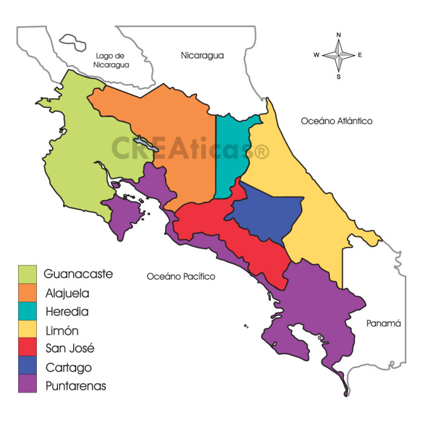

theme: minima
# Encabezado de nivel 1

Otro encabezado de nivel 1
============
<h1>Encabezado de nivel 1 en HTML</h1>

## Encabezado de nivel 2

Otro encabezado de nivel 2
---------------
Lorem ipsum dolor sit amet, consectetur adipiscing elit. Donec metus justo, rhoncus et facilisis vel, sodales eget dolor. Sed finibus lorem velit, vel maximus lorem ornare vitae. Morbi ornare sodales pretium. Donec a lorem eu leo porta semper. Maecenas dignissim elit vel orci semper porttitor. Aliquam congue lorem vel enim commodo faucibus. Vestibulum hendrerit turpis eget augue tempus iaculis. Curabitur leo nunc, efficitur sed ornare et, posuere sed turpis. Suspendisse ultricies justo tortor, vel interdum eros laoreet aliquam. Praesent eu lacus volutpat nulla consectetur laoreet. Sed vel ultricies tellus. Pellentesque non nunc aliquet est feugiat tristique. Nulla mollis, quam sed interdum faucibus, est mauris facilisis enim, eu posuere felis dolor quis est.

Una línea.    
Otra línea.    
Otra Línea más.  
Y otra línea más.  

**texto en negrita**  
__negrita__

*texto italica*  
_italica_

***negrita e italica***    
**_negr e italica_**

> "*Yo solo sé que no sé nada*" Sócrates

> "*En un lugar de la mancha ...¨* Cervantes

**Lista numerada**

1. arroz
2. Frijoles
3. Sandía

**Lista no Numerada**

- Arroz 
    - frijoles
    - cafe 
- Sandía  
    - azucar

[mediación virtual](https://mv1.mediacionvirtual.ucr.ac.cr/login/index.php)

[markdowm](https://www.markdownguide.org/basic-syntax/)

**imagen en sintxis MD**  

  

**IMAGEN EN SINTAXIS HTML**

**imagen en sintxis MD**  

   

##### Encabezado de nivel 5
###### Encabezado de nivel 6
